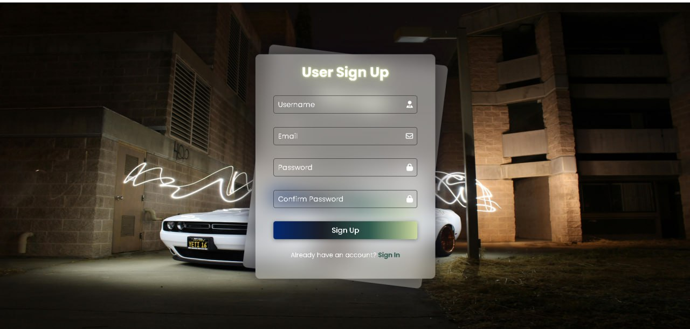
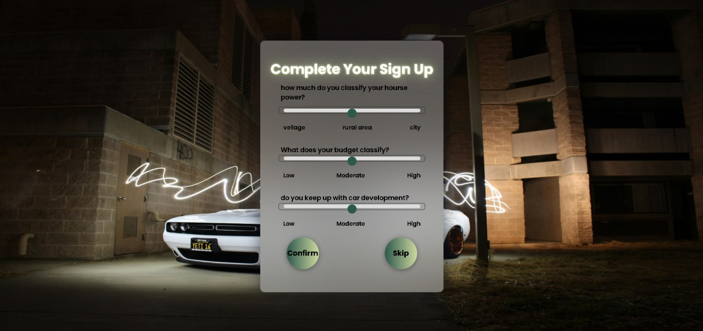
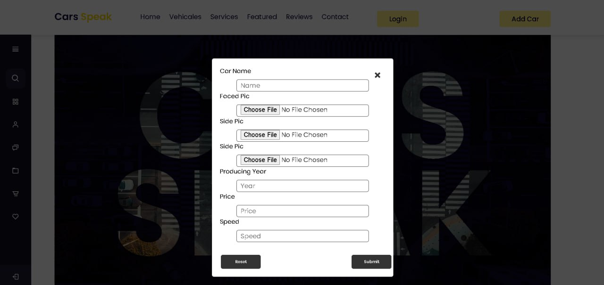
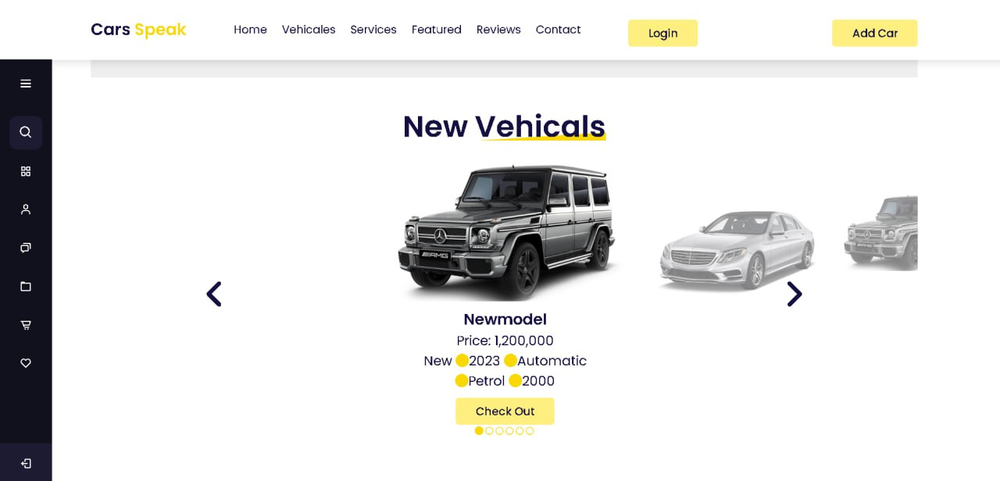
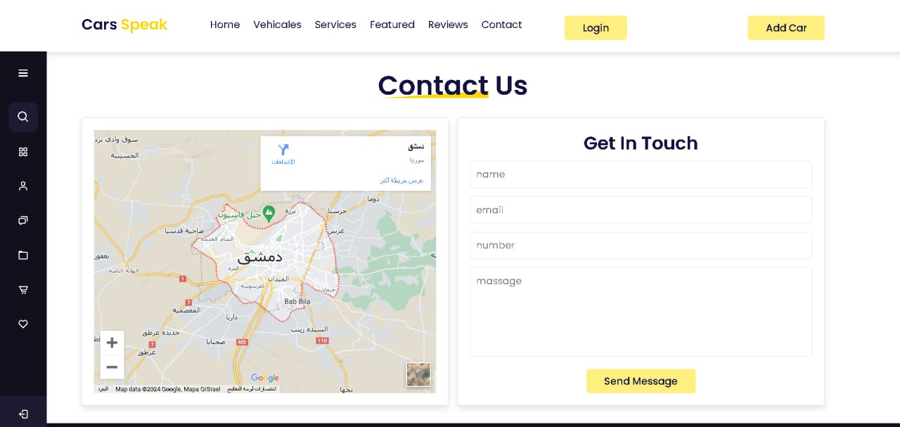
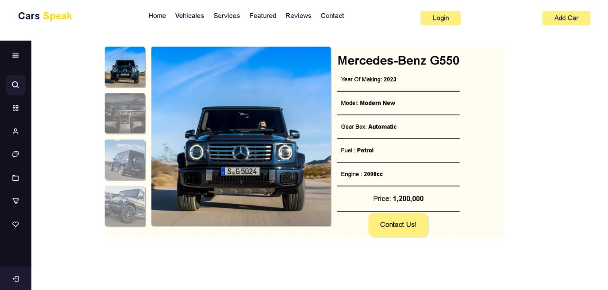

# car-market-website
A responsive car marketplace website built with HTML, CSS, and JavaScript.

## 🚗 Features
- Browse and view car listings
- Search and filter cars by brand or price
- Responsive design for mobile and desktop
- Interactive UI elements with JavaScript

## 🛠️ Technologies Used
- HTML5
- CSS3
- JavaScript (Vanilla JS)
## 🖼️ Project Preview

### Login And Signup Pages

### 🏠 Home Page

### 🚗 Car Details

